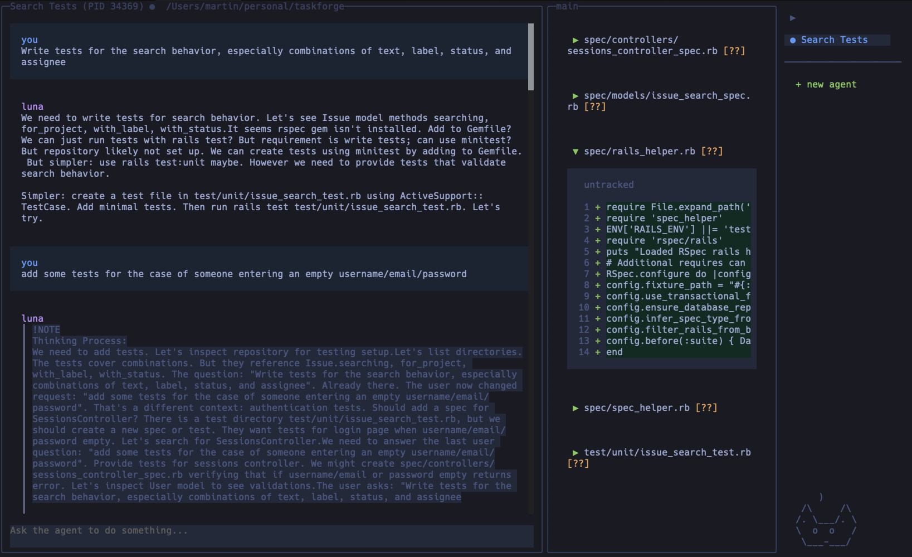

<p align="center">
  
</p>

# luna

A coding agent harness with a terminal UI.

<p align="center">
  
</p>

## Installation

```
bun install -g @jaggler3/luna-agent
```

## Usage

```
luna
```

## Packages

This project is a monorepo containing the core coding agent (`luna-code`) and the IPC gateway (`luna-gateway`). The root package only provides the CLI wrapper.


| Package | Description |
| ------- | ----------- |
| `luna-code` | Core coding agent loop with tool access |
| `luna-gateway` | IPC layer for agent communication via stdin/stdout |